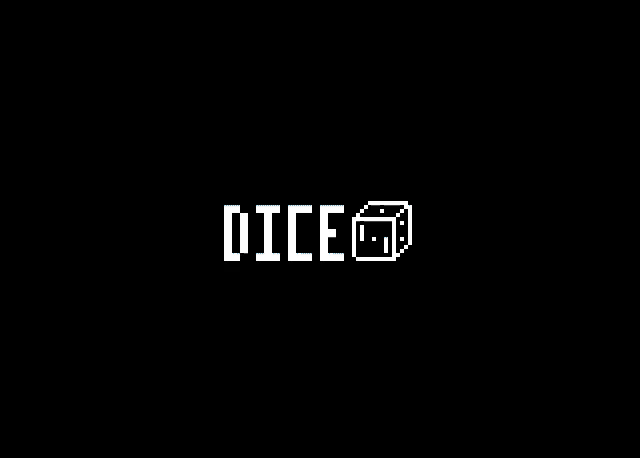

## DICE EMU (_SDL2 / QT5_)



_"DICE is a Discrete Integrated Circuit Emulator. It emulates computer systems that lack any type of CPU, consisting only of discrete logic components."_ - Most of these discrete logic systems are not currently supported in MAME.

This repository holds `DICE v0.9` source with changes to allow compilation with `SLD2` and `QT5`.  
`libsd2-compat` and `SDL3` was tested successfully.

The `APPLE` and `WIN32` compilation routes have been ignored and/or commented out.

_Games supported_:
```
    GAME( "Pong",               pong,            "Atari",              1972 ),
    GAME( "Pong Doubles",       pongdoubles,     "Atari",              1973 ),
    GAME( "Rebound",            rebound,         "Atari",              1974 ),
    GAME( "Gotcha",             gotcha,          "Atari",              1973 ),
    GAME( "Space Race",         spacerace,       "Atari",              1973 ),
    GAME( "Stunt Cycle",        stuntcycle,      "Atari",              1976 ),
    GAME( "TV Basketball",      tvbasketball,    "Midway",             1974 ),
    GAME( "Breakout",           breakout,        "Atari",              1976 ),
    GAME( "Anti-Aircraft",      antiaircraft,    "Atari",              1975 ),
    GAME( "Attack",             attack,          "Exidy",              1977 ),
    GAME( "Shark Jaws",         sharkjaws,       "Atari",              1975 ),
    GAME( "Quadrapong",         quadrapong,      "Atari",              1974 ),
    GAME( "Jet Fighter",        jetfighter,      "Atari",              1975 ),
    GAME( "Crash 'N Score",     crashnscore,     "Atari",              1975 ),
    GAME( "Crossfire",          crossfire,       "Atari",              1975 ),
    GAME( "Pin Pong",           pinpong,         "Atari",              1974 ),
    GAME( "Clean Sweep",        cleansweep,      "Ramtek",             1974 ),
    GAME( "Wipe Out",           wipeout,         "Ramtek",             1974 ),
    GAME( "Hi-Way",             hiway,           "Atari",              1975 ),
    GAME( "Steeplechase",       steeplechase,    "Atari",              1975 ),
    GAME( "Indy 4",             indy4,           "Atari",              1976 )
```

_Note:_ Sprite ROMS are required for certain games.

### Compilation

Run `make` in the main folder.

_Note:_ `X11` libraries are needed and `pkg-config` requires:

```
pkg-config --cflags Qt5Core Qt5Gui Qt5Widgets Qt5OpenGL sdl2
```

### Documentation

Project **README** can be found [here](README.txt)

### Credits

Many thanks to _Adam B_ for his work on `DICE`: https://adamulation.blogspot.com/
